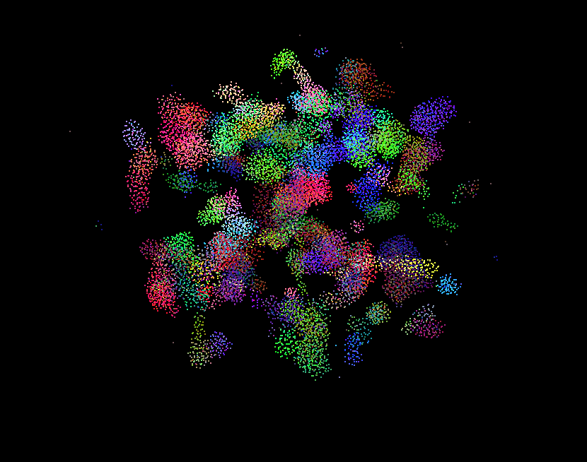
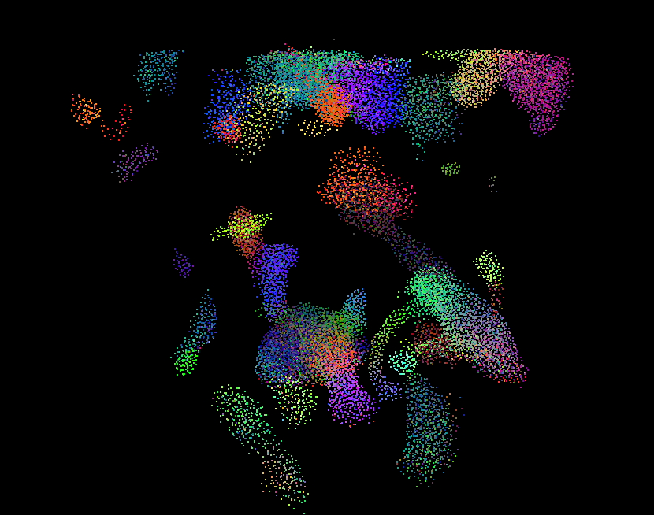
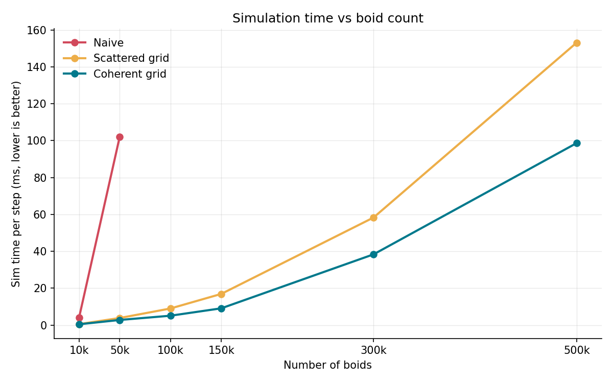
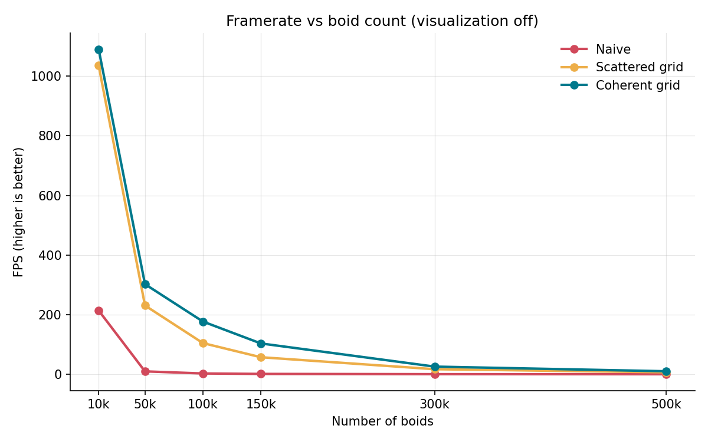
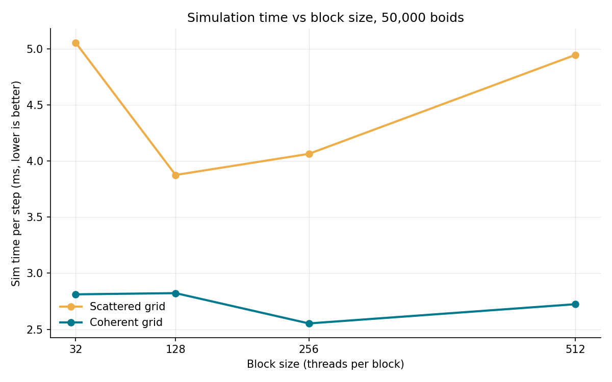
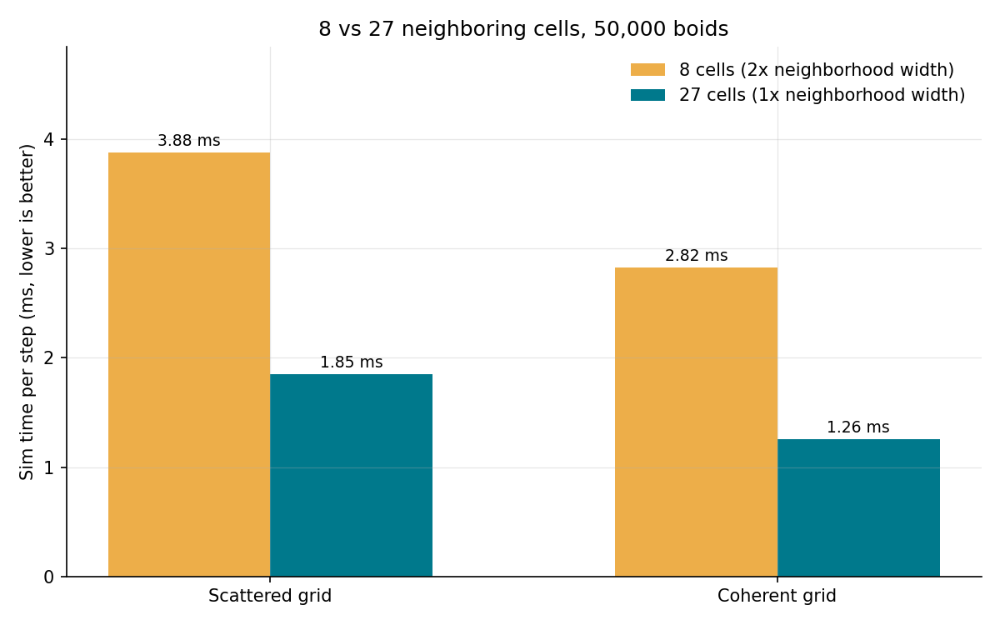
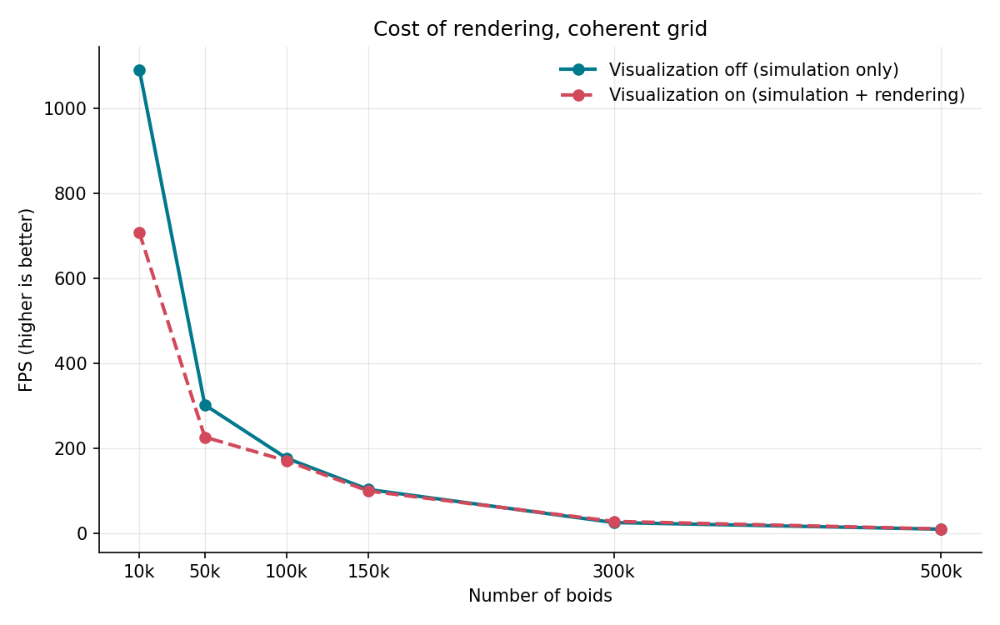

Project 1 - Boids
====================

**University of Pennsylvania, CIS 5650: GPU Programming and Architecture, Project 1**

* Mark Melkumyan
  * [LinkedIn](https://www.linkedin.com/in/mark-melkumyan/), [personal website](https://www.marklikes.art/)
* Tested on: Windows 11, i7-10750H @ 2.60GHz, 64GB RAM, GTX 1650 Ti 4096MB

> N = 20,000 | scene scale = 100 | Rule1Distance = 9.0 | Rule2Distance = 3.0 | Rule3Distance = 9.0

## What are boids?

Boids are bird like particles with position and velocity. They follow three main rules: 
- **Cohesion**: stay close to neighbors
- **Separation**: but don't get too close to neighbors
- **Alignment**: look in a similar direction as neighbors

This project implements 3 versions of this algorithm:
- **Naive**: Loop through ALL other boids when calculating distance to neighbors.
- **Scattered uniform grid**: Divide the simulation into a grid of 3D cells (spatial index). Only check boids in neighboring cells.
- **Coherent uniform grid**: Same as above, but reorder the buffers so boid data is more contiguous in memory.

## Performance analysis

Methodology:

- Data was measured in Release mode, with V-sync turned off.
- Timing was recorded using CUDA events around the `stepSimulation*()` functions, so rendering timing is excluded.
- Every run is given 200 warmup frames. 

--- 
### Q1 - Boid Count vs Performance

#### Table: Simulation time step (ms)

| Boids | Naive | Scattered | Coherent |
|---|---|---|---|
| 10,000 | 4.20 | 0.58 | 0.48 |
| 50,000 | 102.13 | 3.88 | 2.82 |
| 100,000 | 376.10 | 9.04 | 5.12 |
| 150,000 | 851.14 | 16.94 | 9.13 |
| 300,000 | 3401.54  | 58.34 | 38.38 |
| 500,000 | 10422.10 | 153.10 | 98.67 |

> block size = 128, 8 adjacent cells, viz off

#### Notes:

- As expected, all approaches get slower as N grows.
- At 500,000 boids, coherent is ~100x faster than naive.
- The grid approaches scale much better because instead of checking N^2 boids, we only check in a set volume around each boid. This set volume still gets denser at higher boid counts though.
- At low levels of boids (<1000), naive performs *closer* to the grid approaches. This is due to the setup cost of the spatial indexes. 

--- 
### Q2 - Block Size and Block Count vs Performance

#### Table: Simulation time step (ms), 50,000 boids:

| Block | Naive | Scattered | Coherent |
|---|---|---|---|
| 32 | 145.39 | 5.06 | 2.81 |
| 128 | 102.13 | 3.88 | 2.82 |
| 256 | 105.07 | 4.06 | 2.55 |
| 512 | 109.98 | 4.95 | 2.72 |
| 1024 | 113.48 | - | - |

> N = 50,000, 8 adjacent cells, viz off

#### Notes:

- Coherent grid shows minor variation in performance based on block size. This is likely because each is divisible by 32 (threads per warp on the GPU).
- Scattered shows noticably better performance at block sizes of 128 and 256. I'm not quite sure why this differs from coherent.
- 1024 failed on both grid kernels with a `too many resources requested for launch` error. SM 7.5 has 65,536 registers per block. Reducing the memory usage of my kernel could get it under this limit (future work!)

--- 
### Q3 - Coherent vs Scattered Performance

#### Table: Scattered vs Coherent simulation time step (ms):

| Boids | Scattered | Coherent | Speedup |
|---|---|---|---|
| 10,000 | 0.58 | 0.48 | 1.21x |
| 50,000 | 3.88 | 2.82 | 1.37x |
| 100,000 | 9.04 | 5.12 | 1.76x |
| 150,000 | 16.94 | 9.13 | 1.85x |
| 300,000 | 58.34 | 38.38 | 1.52x |
| 500,000 | 153.10 | 98.67 | 1.55x |

> block size = 128, 8 adjacent cells, viz off

#### Notes:
- Scattered takes extra steps through chasing pointers, resulting in reading more *non-contiguous* boid data in memory.
- Coherent is consistently faster than scattered (~1.5x). This is due to more *contiguous* boid data in memory.
- Yes, this was the expected result. 

--- 
### Q4. 8 vs 27 Adjacent Cell Algorithm Performance

> block size = 128, 8 adjacent cells, viz off

#### Notes:
- Unexpectedly, 27 cells performed ~2x better than 8 cells. This is likely because the 27 cells search a smaller volume: 
  - 8 cells x 2r width = 8 * (2r)^3 = 64 * r^3
  - 27 cells x r width = 27 * r^3 = 27 * r^3
- The 8 cell approach covers about ~2x more volume than the 27 cell approach

--- 
### Visualization on vs off

> Recorded with block size of 128, 8 adjacent cells, and viz off

#### Coherent grid FPS:

| Boids | Vis off | Vis on | 
|---|---|---|
| 10,000 | 1090.2 | 707.3 | 
| 50,000 | 302.2 | 226.5 | 
| 100,000 | 176.8 | 170.7 | 
| 150,000 | 103.4 | 99.8 |
| 300,000 | 25.7 | 28.4 |
| 500,000 | 10.1 | 10.7 |

#### Notes:
- Rendering costs more when the simulation is cheap, but relatively little once it's expensive.
- Past 100k the cost of visualization is negligible.